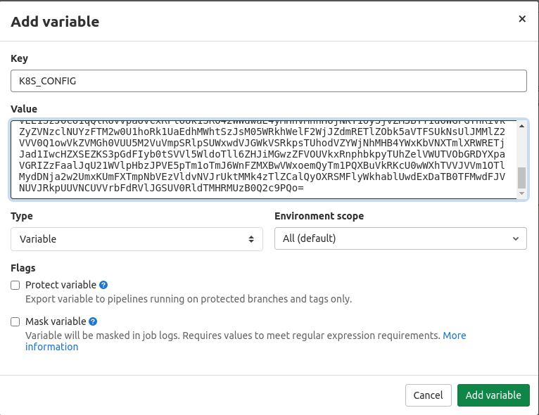
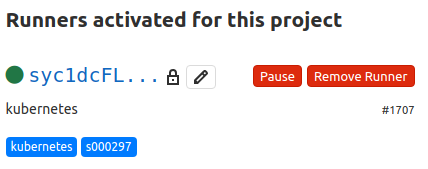

# Авторизация для раннера в кластере k8s

В практике к этой лекции испытаем два способа авторизации для раннеров взаимодействуйющих с кластером k8s.

## Авторизация kubeconfig'ом

Первый наиболее простой:

```
$ ssh sbox.slurm.io
$ ssh master-1.s000297
$ sudo -i
# cat /root/.kube/config | base64 -w 0 ; echo
```

Вывод последней команды необходимо сохранить. Теперь создайте новый репозиторий и перейдите в Settings - CI/CD, затем раскройте раздел Variables. Нажмите "Add variable" и заполните поля по подобию скриншота:



Поле value заполняется выводом последней команды на мастер-ноде k8s. Данные переменные хранятся в зашифрованном в базе данных гитлаба, поэтому Variables допустимо использовать для хранения чувствительных данных.

Теперь можно создать минимальный пайплайн следующего вида:

```yaml
stages:
- kubectl

Kubectl:
  stage: kubectl
  image:
    name: bitnami/kubectl:1.18.2
    entrypoint: [""]
  variables:
    KUBECONFIG: /tmp/.kubeconfig
  script:
  - echo "$K8S_CONFIG" | base64 -d > $KUBECONFIG
  - kubectl get nodes
```

Из-за особенностей образа от bitnami, а именно работы под непривилигерованным пользователем, нужно выбирать нестандартное расположение для kubeconfig-файла (прав на запись в другие места просто нет) и надо затереть entrypoint контейнера, так как иначе формируются команды вида `kubectl sh -c <ВАШ_СКРИПТ>`.

При условии, что есть сетевая доступность между средой раннера и аписервером k8s, мы увидим, как пайплайн взаимодействует с кластером (получать список его серверов).

## In-cluster авторизация

Альтернативно можно запускать пайплайны внутри кластера, используя kubernetes executor. Перейдите на мастер-ноду кластера и подготовьте кластер для работы с kubernetes executor:

```
kubectl create ns runner
kubectl create sa -n runner runner
kubectl create clusterrolebinding --clusterrole=cluster-admin --serviceaccount=runner:runner runner
```

Воспользуйтесь, например, скриптом `02-lecture/01-gitlab-runner/register.sh`, чтобы создать конфиг для раннера в k8s:

```
$ ./register.sh 
Runtime platform                                    arch=amd64 os=linux pid=7 revision=264446b2 version=13.2.4
Running in system-mode.                            
                                                   
Please enter the gitlab-ci coordinator URL (e.g. https://gitlab.com/):
https://gitlab.slurm.io/
Please enter the gitlab-ci token for this runner:
XXXXXXXXXXXXXXXXXXXX
Please enter the gitlab-ci description for this runner:
[]: kubernetes
Please enter the gitlab-ci tags for this runner (comma separated):
s000297,kubernetes
Registering runner... succeeded                     runner=Tsrga9fQ
Please enter the executor: custom, parallels, ssh, docker+machine, docker-ssh+machine, docker, docker-ssh, shell, virtualbox, kubernetes:
kubernetes
Runner registered successfully. Feel free to start it, but if it's running already the config should be automatically reloaded! 
```

Сформированный конфиг (по-умолчанию `02-lecture/01-gitlab-runner/config/config.toml`) должен иметь подобный вид:

```
concurrent = 1
check_interval = 0

[session_server]
  session_timeout = 1800

[[runners]]
  name = "kubernetes"
  url = "https://gitlab.slurm.io/"
  token = "XXXXXXXXXXXXXXXXXXXX"
  executor = "kubernetes"
  [runners.kubernetes]
    namespace = "runner"
    service_account_overwrite_allowed = "runner"
```

Последняя строчка ключевая и её необходимо самостоятельно добавить. На деле полей будет больше, но выше оставлены только необходимые. Скопируйте файл на мастер-ноду k8s и выполните там

```
kubectl create configmap -n runner --from-file=config.toml runner
```

Наконец примените к кластеру манифест `10-lecture/kubernetes-executor/runner.yml`

```
kubectl apply -f runner.yml
```

Спустя несколько секунд изменения отобразятся в веб-интерфейсе гитлаба:



Теперь используя этот раннер мы можем получить доступ в кластер следующим образом:

```yaml
stages:
- kubectl

Kubectl:
  stage: kubectl
  tags:
  - s000297
  - kubernetes
  image:
    name: bitnami/kubectl:1.18.2
  variables:
    KUBECONFIG: /tmp/.kubeconfig
    KUBERNETES_SERVICE_ACCOUNT_OVERWRITE: runner
  script:
  - kubectl config set-cluster local --server=https://kubernetes.default.svc --certificate-authority=/var/run/secrets/kubernetes.io/serviceaccount/ca.crt 
  - kubectl config set-context local --cluster=local --user=user
  - kubectl config set-credentials user --token=$(cat /var/run/secrets/kubernetes.io/serviceaccount/token)
  - kubectl config use-context local
  - kubectl get nodes
```

Как и в предыдущем случае, в пайплайне будут отображены серверы кластера.
