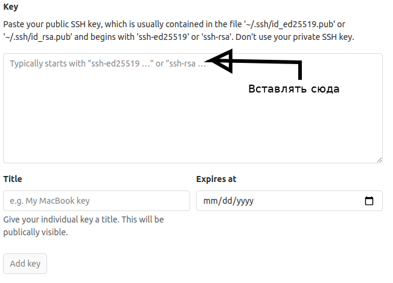

## Настройка рабочего окружения

### SSH ключи для работы с гитлабом

```bash
if [[ ! -e ~/.ssh/slurm.io_ed25519 ]]
then
  ssh-keygen -t ed25519 -f ~/.ssh/slurm.io_ed25519
fi

if ! grep '.ssh/slurm.io_ed25519' ~/.ssh/config
then
  cat <<EOF > ~/.ssh/config
  Host gitlab.slurm.io
    IdentityFile ~/.ssh/slurm.io_ed25519
    User git
EOF
fi

cat ~/.ssh/slurm.io_ed25519.pub
```

Пример вывода:

```
ssh-ed25519 AAAACCCCCCCCCCCNNNNNAAAAAJJJJJJJJJJyyyyyyyy/jjjjjjjjjooooooooooooo+d username@hostname
```

Вывод -- публичный ключ -- надо скопирвоать и вставить по ссылке [https://gitlab.slurm.io/profile/keys](https://gitlab.slurm.io/profile/keys).



### Рабочее пространство

Создайте директорию для хранения рабочего окружения:

```bash
export SLURM_HOME=$HOME/Slurm.io
mkdir -p $SLURM_HOME
cd $SLURM_HOME
```

Склонируйте репозиторий:

```
git clone ssh://git@gitlab.slurm.io/edu/ci-cd/cicd.git
cd cicd
```

Последующие примеры bash-команд будут предполагать, что репозиторий и рабочие окружения расположены именно по этим путям.

## Установка необходимых утилит

### Cfssl (Linux)

Cfssl - утилита с чуть более современным интерфейсом, чем OpenSSL. В некоторых практических заданиях потребуется выписывать TLS-сертификаты и примеры команд будут даны для cfssl.

Способ установки:

```bash
wget https://github.com/cloudflare/cfssl/releases/download/v1.4.1/cfssl_1.4.1_linux_amd64
wget https://github.com/cloudflare/cfssl/releases/download/v1.4.1/cfssljson_1.4.1_linux_amd64

chmod a+x cfssl_1.4.1_linux_amd64 cfssljson_1.4.1_linux_amd64

mv cfssljson_1.4.1_linux_amd64 cfssljson

mv cfssl_1.4.1_linux_amd64 cfssl

sudo mv cfssl cfssljson /usr/local/bin/
```
